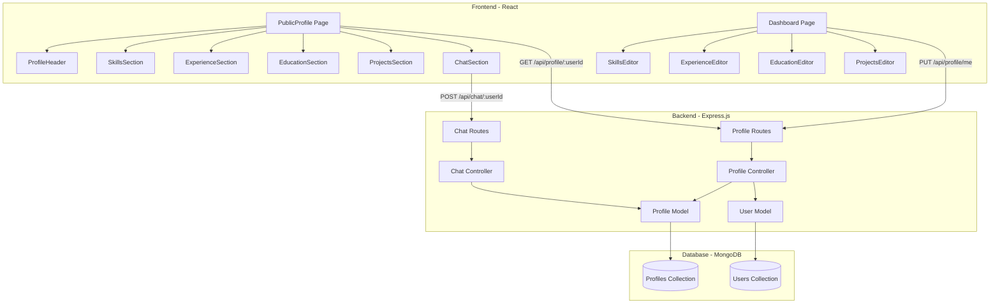

# Design Document: Dark Theme Profile & Chat UI

## Overview

This design document outlines the technical architecture for implementing a modern, dark-themed profile page with integrated AI chat functionality for the AI recruiter application. The feature transforms the existing PublicProfile page into a visually appealing, professional interface that showcases candidate information (skills, experience, education, projects) alongside an AI-powered chat assistant.

### Goals

- Implement a cohesive dark theme across the entire profile page
- Create reusable, maintainable React components for profile sections
- Extend backend data models to support comprehensive profile information
- Provide a responsive layout that works across all device sizes
- Maintain existing chat functionality while improving visual presentation
- Enable profile editing capabilities through the dashboard

### Non-Goals

- Real-time collaboration features
- Video or audio chat integration
- Advanced analytics or tracking beyond basic view counts
- Multi-language support (Turkish is the primary language)
- Profile comparison or matching algorithms

## Architecture

### System Architecture



### Component Hierarchy


```
PublicProfile (Page)
├── ProfileHeader (Component)
│   ├── Avatar (Visual Element)
│   ├── User Info (Name, Title, Email)
│   ├── Bio Text
│   ├── Social Links (Pills)
│   └── Stats (Views, Questions)
├── SkillsSection (Component)
│   └── Skill Pills (Grouped by Category)
├── ExperienceSection (Component)
│   └── Timeline Items (Company, Title, Dates, Description)
├── EducationSection (Component)
│   └── Timeline Items (Institution, Degree, Field, Dates)
├── ProjectsSection (Component)
│   └── Project Cards (Name, Description, Technologies, GitHub Link)
└── ChatSection (Component)
    ├── Chat Header
    ├── Messages List
    ├── Input Area
    └── Suggested Questions
```

### Data Flow

1. **Profile Loading Flow:**
   - User navigates to `/profile/:userId`
   - PublicProfile component fetches data via `GET /api/profile/:userId`
   - Backend increments `profileViews` counter
   - Backend returns user info + profile data
   - React components render with received data

2. **Profile Editing Flow:**
   - User edits profile in Dashboard
   - Editor component sends `PUT /api/profile/me` with updated data
   - Backend validates and updates MongoDB document
   - Frontend receives updated profile and shows success message


3. **Chat Interaction Flow:**
   - User types message in ChatSection
   - Frontend sends `POST /api/chat/:userId` with message history
   - Backend uses AI (Gemini) to generate response based on profile data
   - Frontend displays AI response
   - Backend increments `chatCount` counter

## Components and Interfaces

### Frontend Components

#### ProfileHeader Component

**Purpose:** Display user's basic information, avatar, bio, social links, and profile statistics.

**Props:**
```typescript
interface ProfileHeaderProps {
  user: {
    name: string;
    email: string;
  };
  profile: {
    title?: string;
    bio?: string;
    links: {
      github?: string;
      linkedin?: string;
      artbook?: string;
      website?: string;
    };
    profileViews: number;
    chatCount: number;
  };
}
```

**Styling:**
- Dark background (`bg-gray-900`)
- Circular gradient avatar (cyan to blue)
- Social links as pill-style buttons with hover effects
- Responsive flex layout (column on mobile, row on desktop)


#### SkillsSection Component

**Purpose:** Display user's technical skills grouped by category with color-coded pills.

**Props:**
```typescript
interface SkillsSectionProps {
  skills: Array<{
    category: 'Frontend' | 'Backend' | 'Database' | 'DevOps' | 'Tools' | 'Soft Skills' | 'Other';
    name: string;
  }>;
}
```

**Logic:**
- Group skills by category using `reduce()`
- Map categories to accent colors (green, cyan, blue, purple, yellow, pink, gray)
- Apply hover scale effect (1.05) with 200ms transition

**Styling:**
- Semi-transparent dark card (`bg-gray-800/50`)
- Rounded borders (`rounded-xl`)
- Flex-wrap layout for pills
- Category-specific colors with opacity

#### ExperienceSection Component

**Purpose:** Display work experience in a vertical timeline layout.

**Props:**
```typescript
interface ExperienceSectionProps {
  experience: Array<{
    company: string;
    title: string;
    startDate: Date;
    endDate?: Date;
    description?: string;
  }>;
}
```

**Logic:**
- Sort experiences by `startDate` in reverse chronological order
- Format dates using Turkish locale (`tr-TR`)
- Display "Şu an" for current positions (no endDate)


**Styling:**
- Vertical timeline with left border (`border-l-2 border-gray-700`)
- Cyan dots for timeline markers
- Absolute positioning for dots relative to timeline

#### EducationSection Component

**Purpose:** Display education history in a vertical timeline layout.

**Props:**
```typescript
interface EducationSectionProps {
  education: Array<{
    institution: string;
    degree: string;
    fieldOfStudy: string;
    startDate: Date;
    endDate?: Date;
  }>;
}
```

**Logic:**
- Sort education entries by `startDate` in reverse chronological order
- Format dates using Turkish locale
- Display "Devam ediyor" for ongoing education (no endDate)

**Styling:**
- Similar to ExperienceSection but with blue dots instead of cyan
- Same timeline structure

#### ProjectsSection Component

**Purpose:** Display projects in a responsive card grid.

**Props:**
```typescript
interface ProjectsSectionProps {
  projects: Array<{
    name: string;
    description: string;
    technologies: string[];
    githubUrl?: string;
  }>;
}
```


**Styling:**
- Responsive grid: 1 column (mobile), 2 columns (tablet), 3 columns (desktop)
- Card hover effects: shadow + translateY(-4px)
- Technology tags as small pills
- Conditional GitHub button rendering

#### ChatSection Component

**Purpose:** Provide AI chat interface for asking questions about the candidate.

**Props:**
```typescript
interface ChatSectionProps {
  userId: string;
  userName: string;
  hasCV: boolean;
}
```

**State:**
```typescript
interface ChatState {
  messages: Array<{
    role: 'user' | 'model';
    text: string;
  }>;
  input: string;
  chatLoading: boolean;
}
```

**Logic:**
- Auto-scroll to bottom on new messages using `useRef` and `useEffect`
- Handle Enter key for sending messages (Shift+Enter for new line)
- Display loading indicator while waiting for AI response
- Show warning badge if CV not uploaded

**Styling:**
- Fixed height container (`min-height: 500px`)
- User messages: cyan background, right-aligned
- AI messages: gray background, left-aligned
- Rounded message bubbles with tail effect


### Dashboard Editor Components

#### SkillsEditor Component

**Purpose:** Allow users to add/remove skills with category selection.

**Features:**
- Dropdown for category selection
- Text input for skill name
- Add button to append to skills array
- Delete button for each skill
- Validation: max 50 characters per skill name

#### ExperienceEditor Component

**Purpose:** Allow users to add/edit/remove work experience entries.

**Features:**
- Form fields: company, title, startDate, endDate, description
- Checkbox for "Currently working here" (sets endDate to null)
- Date pickers for start/end dates
- Textarea for description (max 1000 characters)
- Add/Edit/Delete buttons

#### EducationEditor Component

**Purpose:** Allow users to add/edit/remove education entries.

**Features:**
- Form fields: institution, degree, fieldOfStudy, startDate, endDate
- Checkbox for "Currently studying" (sets endDate to null)
- Date pickers for start/end dates
- Add/Edit/Delete buttons

#### ProjectsEditor Component

**Purpose:** Allow users to add/edit/remove project entries.

**Features:**
- Form fields: name, description, githubUrl
- Tag input for technologies (array of strings)
- Add/Edit/Delete buttons
- URL validation for githubUrl


## Data Models

### Profile Model (MongoDB Schema)

```javascript
const ProfileSchema = new mongoose.Schema({
  user: {
    type: mongoose.Schema.Types.ObjectId,
    ref: 'User',
    required: true,
    unique: true,
  },
  bio: {
    type: String,
    default: '',
    maxlength: 500,
  },
  title: {
    type: String,
    default: '',
    maxlength: 100,
  },
  links: {
    github:   { type: String, default: '' },
    linkedin: { type: String, default: '' },
    artbook:  { type: String, default: '' },
    website:  { type: String, default: '' },
  },
  skills: [{
    category: {
      type: String,
      required: true,
      enum: ['Frontend', 'Backend', 'Database', 'DevOps', 'Tools', 'Soft Skills', 'Other'],
    },
    name: {
      type: String,
      required: true,
      maxlength: 50,
    },
  }],
  experience: [{
    company: {
      type: String,
      required: true,
      maxlength: 100,
    },
    title: {
      type: String,
      required: true,
      maxlength: 100,
    },
    startDate: {
      type: Date,
      required: true,
    },
    endDate: {
      type: Date,
      default: null,
    },
    description: {
      type: String,
      default: '',
      maxlength: 1000,
    },
  }],
  education: [{
    institution: {
      type: String,
      required: true,
      maxlength: 150,
    },
    degree: {
      type: String,
      required: true,
      maxlength: 100,
    },
    fieldOfStudy: {
      type: String,
      required: true,
      maxlength: 100,
    },
    startDate: {
      type: Date,
      required: true,
    },
    endDate: {
      type: Date,
      default: null,
    },
  }],
  projects: [{
    name: {
      type: String,
      required: true,
      maxlength: 100,
    },
    description: {
      type: String,
      required: true,
      maxlength: 500,
    },
    technologies: [{
      type: String,
      maxlength: 30,
    }],
    githubUrl: {
      type: String,
      default: '',
      maxlength: 200,
    },
  }],
  cvPath: {
    type: String,
    default: '',
  },
  cvText: {
    type: String,
    default: '',
  },
  linkContext: {
    type: String,
    default: '',
  },
  profileViews: {
    type: Number,
    default: 0,
  },
  chatCount: {
    type: Number,
    default: 0,
  },
  createdAt: {
    type: Date,
    default: Date.now,
  },
});
```


**Schema Notes:**
- All array fields support empty arrays (no minimum length requirement)
- `endDate` can be null to indicate current/ongoing status
- String fields have maxlength validation to prevent abuse
- `skills.category` uses enum to ensure valid categories
- `user` field has unique constraint (one profile per user)

### API Endpoints

#### GET /api/profile/:userId

**Purpose:** Fetch public profile data for display.

**Response:**
```json
{
  "success": true,
  "user": {
    "name": "John Doe",
    "email": "john@example.com"
  },
  "profile": {
    "title": "Full Stack Developer",
    "bio": "Passionate developer with 5 years of experience...",
    "links": {
      "github": "https://github.com/johndoe",
      "linkedin": "https://linkedin.com/in/johndoe",
      "artbook": "",
      "website": "https://johndoe.com"
    },
    "skills": [
      { "category": "Frontend", "name": "React" },
      { "category": "Backend", "name": "Node.js" }
    ],
    "experience": [...],
    "education": [...],
    "projects": [...],
    "hasCV": true,
    "profileViews": 42,
    "chatCount": 15
  }
}
```

**Side Effects:**
- Increments `profileViews` counter by 1


#### PUT /api/profile/me

**Purpose:** Update authenticated user's profile data.

**Authentication:** Required (JWT token)

**Request Body:**
```json
{
  "bio": "Updated bio text",
  "title": "Senior Full Stack Developer",
  "github": "https://github.com/johndoe",
  "linkedin": "https://linkedin.com/in/johndoe",
  "artbook": "",
  "website": "https://johndoe.com",
  "skills": [
    { "category": "Frontend", "name": "React" },
    { "category": "Frontend", "name": "Vue.js" }
  ],
  "experience": [...],
  "education": [...],
  "projects": [...]
}
```

**Response:**
```json
{
  "success": true,
  "profile": { /* updated profile object */ }
}
```

**Validation:**
- All fields are optional (partial updates supported)
- Mongoose schema validation applies (maxlength, enum, required fields within arrays)
- Returns 400 with validation error messages if validation fails

#### POST /api/chat/:userId

**Purpose:** Send a message to the AI assistant about a candidate.

**Request Body:**
```json
{
  "messages": [
    { "role": "model", "text": "Merhaba! Ben bu adayın AI asistanıyım..." },
    { "role": "user", "text": "React deneyimi var mı?" }
  ]
}
```


**Response:**
```json
{
  "reply": "Evet, adayın React konusunda deneyimi var. Profilde Frontend kategorisinde React becerisi listeleniyor..."
}
```

**Side Effects:**
- Increments `chatCount` counter by 1
- Uses Gemini AI to generate contextual responses based on profile data

## Correctness Properties

*A property is a characteristic or behavior that should hold true across all valid executions of a system—essentially, a formal statement about what the system should do. Properties serve as the bridge between human-readable specifications and machine-verifiable correctness guarantees.*

**Note on Property-Based Testing Applicability:**

This feature is primarily focused on UI rendering, styling, and layout, which are not well-suited for property-based testing. Most requirements involve visual presentation (colors, spacing, hover effects) that are better tested through snapshot testing, visual regression testing, or manual inspection. However, there are a few data transformation and sorting behaviors that can be validated with property-based tests.

### Property 1: Skills Grouping Correctness

*For any* array of skills with valid category values, the grouping function SHALL produce an object where each key is a category and each value is an array containing only skills from that category.

**Validates: Requirements 3.4**

### Property 2: Experience Chronological Sorting

*For any* array of experience entries with valid startDate values, the sorting function SHALL produce an array ordered by startDate in descending order (most recent first).

**Validates: Requirements 4.5**


### Property 3: Education Chronological Sorting

*For any* array of education entries with valid startDate values, the sorting function SHALL produce an array ordered by startDate in descending order (most recent first).

**Validates: Requirements 5.4**

### Property 4: Social Links Target Attribute

*For any* social media link rendered in the ProfileHeader component, the anchor element SHALL have both `target="_blank"` and `rel="noreferrer"` attributes to ensure secure external navigation.

**Validates: Requirements 2.6**

## Error Handling

### Frontend Error Handling

#### Profile Loading Errors

**Scenario:** API request to `/api/profile/:userId` fails or returns 404.

**Handling:**
- Display error message: "Profil bulunamadı."
- Show error in red text on dark background
- Provide link to return to home page

**Implementation:**
```javascript
try {
  const res = await axios.get(`/api/profile/${userId}`);
  setProfileData(res.data);
} catch (error) {
  setError('Profil bulunamadı.');
} finally {
  setLoading(false);
}
```


#### Chat Errors

**Scenario:** AI chat request fails or times out.

**Handling:**
- Display fallback message: "Üzgünüm, bir hata oluştu. Lütfen tekrar deneyin."
- Add message to chat history so user sees the error
- Allow user to retry by sending another message

**Implementation:**
```javascript
try {
  const res = await axios.post(`/api/chat/${userId}`, { messages: newMessages });
  setMessages(prev => [...prev, { role: 'model', text: res.data.reply }]);
} catch {
  setMessages(prev => [...prev, {
    role: 'model',
    text: 'Üzgünüm, bir hata oluştu. Lütfen tekrar deneyin.',
  }]);
}
```

#### Profile Update Errors

**Scenario:** Profile update request fails due to validation or server error.

**Handling:**
- Display error message below form
- Highlight invalid fields if validation errors are returned
- Preserve user input so they can correct and retry

**Implementation:**
```javascript
try {
  await axios.put('/api/profile/me', formData);
  setSuccess('Profil başarıyla güncellendi!');
} catch (error) {
  setError(error.response?.data?.error || 'Güncelleme başarısız.');
}
```


### Backend Error Handling

#### Profile Not Found

**Scenario:** User requests profile for non-existent userId.

**Response:**
```json
{
  "error": "Profil bulunamadı."
}
```
**Status Code:** 404

#### Validation Errors

**Scenario:** Profile update contains invalid data (e.g., skill name exceeds 50 characters).

**Response:**
```json
{
  "error": "Skill name must be at most 50 characters"
}
```
**Status Code:** 400

**Implementation:**
```javascript
if (error.name === 'ValidationError') {
  const messages = Object.values(error.errors).map(err => err.message);
  return res.status(400).json({ error: messages.join(', ') });
}
```

#### Authentication Errors

**Scenario:** User attempts to update profile without valid JWT token.

**Response:**
```json
{
  "error": "Not authorized"
}
```
**Status Code:** 401


#### Server Errors

**Scenario:** Database connection fails or unexpected error occurs.

**Response:**
```json
{
  "error": "Profil getirilemedi."
}
```
**Status Code:** 500

**Logging:**
```javascript
console.error('Profil getirme hatası:', error.message);
```

## Testing Strategy

### Overview

This feature requires a multi-layered testing approach due to its mix of UI rendering, data transformation logic, and API integration. The testing strategy balances property-based testing for data logic, example-based unit tests for component behavior, integration tests for API endpoints, and snapshot/visual testing for UI presentation.

### Unit Testing

**Component Tests (React Testing Library + Vitest):**

1. **ProfileHeader Component:**
   - Test that user name and email are rendered
   - Test that title is conditionally rendered when present
   - Test that bio is rendered when present
   - Test that social links are filtered (only links with URLs are shown)
   - Test that social links have correct `target` and `rel` attributes
   - Test that stats (profileViews, chatCount) are displayed correctly

2. **SkillsSection Component:**
   - Test empty state message when no skills provided
   - Test that skills are grouped by category
   - Test that correct color classes are applied per category
   - Test that all skills within a category are rendered


3. **ExperienceSection Component:**
   - Test empty state message when no experience provided
   - Test that experiences are sorted by startDate (most recent first)
   - Test date formatting (Turkish locale)
   - Test "Şu an" display for current positions (no endDate)
   - Test that all experience fields are rendered

4. **EducationSection Component:**
   - Test empty state message when no education provided
   - Test that education entries are sorted by startDate (most recent first)
   - Test date formatting (Turkish locale)
   - Test "Devam ediyor" display for ongoing education (no endDate)
   - Test that all education fields are rendered

5. **ProjectsSection Component:**
   - Test empty state message when no projects provided
   - Test that all project fields are rendered
   - Test that technologies are rendered as tags
   - Test conditional rendering of GitHub button (only when githubUrl present)
   - Test that GitHub links have correct attributes

6. **ChatSection Component:**
   - Test initial message is displayed
   - Test that user messages are right-aligned with cyan background
   - Test that AI messages are left-aligned with gray background
   - Test that input is cleared after sending message
   - Test that Enter key sends message
   - Test that Shift+Enter adds new line
   - Test loading indicator during AI response
   - Test CV warning badge when hasCV is false


### Property-Based Testing

**Library:** fast-check (JavaScript property-based testing library)

**Configuration:** Minimum 100 iterations per property test

**Property Tests:**

1. **Skills Grouping Property:**
   ```javascript
   // Feature: dark-theme-profile-chat-ui, Property 1: Skills Grouping Correctness
   test('skills grouping produces correct category buckets', () => {
     fc.assert(
       fc.property(
         fc.array(fc.record({
           category: fc.constantFrom('Frontend', 'Backend', 'Database', 'DevOps', 'Tools', 'Soft Skills', 'Other'),
           name: fc.string({ minLength: 1, maxLength: 50 })
         })),
         (skills) => {
           const grouped = groupSkillsByCategory(skills);
           
           // All keys should be valid categories
           Object.keys(grouped).forEach(category => {
             expect(['Frontend', 'Backend', 'Database', 'DevOps', 'Tools', 'Soft Skills', 'Other'])
               .toContain(category);
           });
           
           // All skills in each category should have that category
           Object.entries(grouped).forEach(([category, skillNames]) => {
             const originalSkills = skills.filter(s => s.category === category);
             expect(skillNames.length).toBe(originalSkills.length);
             skillNames.forEach(name => {
               expect(originalSkills.some(s => s.name === name)).toBe(true);
             });
           });
         }
       ),
       { numRuns: 100 }
     );
   });
   ```


2. **Experience Sorting Property:**
   ```javascript
   // Feature: dark-theme-profile-chat-ui, Property 2: Experience Chronological Sorting
   test('experience sorting produces reverse chronological order', () => {
     fc.assert(
       fc.property(
         fc.array(fc.record({
           company: fc.string({ minLength: 1, maxLength: 100 }),
           title: fc.string({ minLength: 1, maxLength: 100 }),
           startDate: fc.date(),
           endDate: fc.option(fc.date()),
           description: fc.string({ maxLength: 1000 })
         })),
         (experiences) => {
           const sorted = sortExperiencesByDate(experiences);
           
           // Check that each item is >= the next item (descending order)
           for (let i = 0; i < sorted.length - 1; i++) {
             expect(new Date(sorted[i].startDate).getTime())
               .toBeGreaterThanOrEqual(new Date(sorted[i + 1].startDate).getTime());
           }
         }
       ),
       { numRuns: 100 }
     );
   });
   ```

3. **Education Sorting Property:**
   ```javascript
   // Feature: dark-theme-profile-chat-ui, Property 3: Education Chronological Sorting
   test('education sorting produces reverse chronological order', () => {
     fc.assert(
       fc.property(
         fc.array(fc.record({
           institution: fc.string({ minLength: 1, maxLength: 150 }),
           degree: fc.string({ minLength: 1, maxLength: 100 }),
           fieldOfStudy: fc.string({ minLength: 1, maxLength: 100 }),
           startDate: fc.date(),
           endDate: fc.option(fc.date())
         })),
         (education) => {
           const sorted = sortEducationByDate(education);
           
           for (let i = 0; i < sorted.length - 1; i++) {
             expect(new Date(sorted[i].startDate).getTime())
               .toBeGreaterThanOrEqual(new Date(sorted[i + 1].startDate).getTime());
           }
         }
       ),
       { numRuns: 100 }
     );
   });
   ```


4. **Social Links Security Property:**
   ```javascript
   // Feature: dark-theme-profile-chat-ui, Property 4: Social Links Target Attribute
   test('all social links have secure external navigation attributes', () => {
     fc.assert(
       fc.property(
         fc.record({
           github: fc.option(fc.webUrl()),
           linkedin: fc.option(fc.webUrl()),
           artbook: fc.option(fc.webUrl()),
           website: fc.option(fc.webUrl())
         }),
         (links) => {
           const { container } = render(<ProfileHeader 
             user={{ name: 'Test', email: 'test@test.com' }}
             profile={{ links, profileViews: 0, chatCount: 0 }}
           />);
           
           const anchors = container.querySelectorAll('a[href]');
           anchors.forEach(anchor => {
             expect(anchor.getAttribute('target')).toBe('_blank');
             expect(anchor.getAttribute('rel')).toBe('noreferrer');
           });
         }
       ),
       { numRuns: 100 }
     );
   });
   ```

### Integration Testing

**Backend API Tests (Jest + Supertest):**

1. **GET /api/profile/:userId:**
   - Test successful profile retrieval
   - Test 404 for non-existent user
   - Test that profileViews counter increments
   - Test that response includes all expected fields


2. **PUT /api/profile/me:**
   - Test successful profile update with valid data
   - Test partial updates (only some fields provided)
   - Test validation errors (e.g., skill name too long)
   - Test authentication requirement (401 without token)
   - Test that response includes updated profile

3. **POST /api/chat/:userId:**
   - Test successful chat message with AI response
   - Test that chatCount counter increments
   - Test error handling when AI service fails

**Database Schema Tests:**

1. **Profile Model Validation:**
   - Test that skills require category and name
   - Test that category enum validation works
   - Test maxlength validation for all string fields
   - Test that experience requires company, title, startDate
   - Test that education requires institution, degree, fieldOfStudy, startDate
   - Test that projects require name and description
   - Test that user field is unique (one profile per user)

### Snapshot Testing

**Component Snapshots (Vitest):**

1. Snapshot test for ProfileHeader with full data
2. Snapshot test for ProfileHeader with minimal data
3. Snapshot test for SkillsSection with multiple categories
4. Snapshot test for ExperienceSection with multiple entries
5. Snapshot test for EducationSection with multiple entries
6. Snapshot test for ProjectsSection with multiple projects
7. Snapshot test for ChatSection initial state


### Visual Regression Testing

**Recommended Tool:** Percy, Chromatic, or Playwright visual testing

**Test Cases:**
1. PublicProfile page on desktop (1920x1080)
2. PublicProfile page on tablet (768x1024)
3. PublicProfile page on mobile (375x667)
4. Hover states for skill pills
5. Hover states for project cards
6. Hover states for social link buttons
7. Chat section with multiple messages
8. Empty states for all sections

### Accessibility Testing

**Tools:** axe-core, Lighthouse

**Test Cases:**
1. Color contrast ratios meet WCAG AA standards
2. All interactive elements are keyboard accessible
3. Focus indicators are visible
4. Semantic HTML is used correctly
5. ARIA labels are present where needed
6. Screen reader compatibility

### Manual Testing Checklist

- [ ] Dark theme colors are consistent across all components
- [ ] Hover effects work smoothly (200-300ms transitions)
- [ ] Responsive layout works on mobile, tablet, desktop
- [ ] Social links open in new tabs
- [ ] Chat auto-scrolls to bottom on new messages
- [ ] Enter key sends chat messages
- [ ] Shift+Enter adds new line in chat
- [ ] Empty states display correctly
- [ ] Loading states display correctly
- [ ] Error messages display correctly
- [ ] Profile editing works in Dashboard
- [ ] All form validations work correctly


## Tailwind CSS Dark Theme Configuration

### Color Palette

The dark theme uses the following Tailwind color classes:

**Backgrounds:**
- Primary background: `bg-gray-900` (#111827)
- Card background: `bg-gray-800/50` (semi-transparent)
- Input background: `bg-gray-900`
- Border color: `border-gray-700` or `border-gray-700/50`

**Text:**
- Primary text: `text-gray-100` (#F3F4F6)
- Secondary text: `text-gray-300` (#D1D5DB)
- Muted text: `text-gray-400` (#9CA3AF)

**Accents:**
- Cyan: `bg-cyan-500`, `text-cyan-400`, `border-cyan-500`
- Green: `bg-green-500`, `text-green-400`, `border-green-500`
- Blue: `bg-blue-500`, `text-blue-400`, `border-blue-500`
- Purple: `bg-purple-500`, `text-purple-400`, `border-purple-500`
- Yellow: `bg-yellow-500`, `text-yellow-400`, `border-yellow-500`
- Pink: `bg-pink-500`, `text-pink-400`, `border-pink-500`

**Interactive States:**
- Hover: `hover:bg-gray-700`, `hover:brightness-110`, `hover:scale-105`
- Focus: `focus:ring-2 focus:ring-cyan-500`
- Disabled: `disabled:opacity-40`

### Tailwind Configuration

No custom configuration needed beyond default Tailwind setup. All colors use standard Tailwind classes.

**tailwind.config.js:**
```javascript
export default {
  content: [
    "./index.html",
    "./src/**/*.{js,ts,jsx,tsx}",
  ],
  theme: {
    extend: {},
  },
  plugins: [],
}
```


### Transition Classes

All hover effects use consistent transition timing:

```css
transition-all duration-200
transition-colors duration-200
transition-transform duration-300
```

### Responsive Breakpoints

Tailwind's default breakpoints are used:
- `sm`: 640px
- `md`: 768px
- `lg`: 1024px
- `xl`: 1280px
- `2xl`: 1536px

**Usage Examples:**
- `flex-col md:flex-row` - Column on mobile, row on tablet+
- `grid-cols-1 md:grid-cols-2 lg:grid-cols-3` - Responsive grid
- `text-3xl md:text-4xl` - Responsive text sizing

## Implementation Notes

### Component Extraction

The existing PublicProfile page already has most components extracted:
- ProfileHeader.jsx ✓
- SkillsSection.jsx ✓
- ExperienceSection.jsx ✓
- EducationSection.jsx ✓
- ProjectsSection.jsx ✓

The ChatSection is currently inline in PublicProfile.jsx and should remain there since it's tightly coupled to the page's state management.

### Data Fetching Strategy

Use React's `useEffect` hook for initial data fetching:

```javascript
useEffect(() => {
  axios.get(`/api/profile/${userId}`)
    .then(res => setProfileData(res.data))
    .catch(() => setError('Profil bulunamadı.'))
    .finally(() => setLoading(false));
}, [userId]);
```


### State Management

No global state management library (Redux, Zustand) is needed. Component-level state with `useState` is sufficient:

```javascript
const [profileData, setProfileData] = useState(null);
const [loading, setLoading] = useState(true);
const [error, setError] = useState('');
const [messages, setMessages] = useState([...]);
const [input, setInput] = useState('');
const [chatLoading, setChatLoading] = useState(false);
```

### Performance Considerations

1. **Memoization:** Use `useMemo` for expensive computations like skills grouping:
   ```javascript
   const groupedSkills = useMemo(() => 
     skills.reduce((acc, skill) => { ... }, {}),
     [skills]
   );
   ```

2. **Lazy Loading:** Consider lazy loading the chat section if it's below the fold:
   ```javascript
   const ChatSection = lazy(() => import('./components/ChatSection'));
   ```

3. **Image Optimization:** Use gradient avatars instead of images to avoid loading delays.

4. **Debouncing:** Debounce chat input if implementing typing indicators.

### Accessibility Considerations

1. **Semantic HTML:** Use proper heading hierarchy (h1, h2, h3)
2. **ARIA Labels:** Add labels for icon-only buttons
3. **Keyboard Navigation:** Ensure all interactive elements are keyboard accessible
4. **Focus Management:** Manage focus when opening/closing modals or editors
5. **Color Contrast:** Verify all text meets WCAG AA standards (4.5:1 for normal text)


### Browser Compatibility

Target modern browsers with ES6+ support:
- Chrome 90+
- Firefox 88+
- Safari 14+
- Edge 90+

No polyfills needed for the current feature set.

## Security Considerations

### XSS Prevention

1. **User Input Sanitization:** React automatically escapes text content, but be cautious with `dangerouslySetInnerHTML` (not used in this feature).

2. **URL Validation:** Validate social media URLs on the backend to prevent javascript: or data: URLs:
   ```javascript
   const isValidUrl = (url) => {
     try {
       const parsed = new URL(url);
       return ['http:', 'https:'].includes(parsed.protocol);
     } catch {
       return false;
     }
   };
   ```

3. **External Links:** Always use `rel="noreferrer"` with `target="_blank"` to prevent tabnabbing attacks.

### Authentication

Profile editing endpoints require JWT authentication via the `protect` middleware:

```javascript
router.put('/me', protect, async (req, res) => { ... });
```

### Rate Limiting

Consider adding rate limiting to chat endpoint to prevent abuse:

```javascript
const rateLimit = require('express-rate-limit');

const chatLimiter = rateLimit({
  windowMs: 15 * 60 * 1000, // 15 minutes
  max: 50 // limit each IP to 50 requests per windowMs
});

router.post('/chat/:userId', chatLimiter, async (req, res) => { ... });
```


### Data Validation

Backend validation is critical:

1. **Mongoose Schema Validation:** Enforces maxlength, required fields, enum values
2. **Custom Validation:** Add custom validators for URLs, dates, etc.
3. **Input Sanitization:** Trim whitespace, normalize data

Example:
```javascript
const ProfileSchema = new mongoose.Schema({
  bio: {
    type: String,
    default: '',
    maxlength: [500, 'Bio must be at most 500 characters'],
    trim: true
  }
});
```

## Deployment Considerations

### Environment Variables

No new environment variables needed. Existing variables:
- `MONGODB_URI` - MongoDB connection string
- `JWT_SECRET` - JWT signing secret
- `GEMINI_API_KEY` - Google Gemini API key

### Build Process

Frontend build command:
```bash
cd client
npm run build
```

This generates optimized production files in `client/dist/`.

### Database Migration

No migration needed. Mongoose will automatically handle new fields with default values for existing documents.

To populate existing profiles with empty arrays:
```javascript
await Profile.updateMany(
  { skills: { $exists: false } },
  { $set: { skills: [], experience: [], education: [], projects: [] } }
);
```


## Future Enhancements

### Phase 2 Features (Out of Scope for Current Design)

1. **Profile Completeness Indicator:**
   - Show percentage of profile completion
   - Suggest missing sections to improve profile

2. **Rich Text Editor:**
   - Allow markdown formatting in bio and descriptions
   - Preview mode for formatted text

3. **Profile Analytics:**
   - Track which sections get the most views
   - Show visitor demographics (if available)

4. **Export Profile:**
   - Generate PDF resume from profile data
   - Export as JSON for backup

5. **Profile Themes:**
   - Allow users to choose from multiple color themes
   - Custom accent color picker

6. **Social Proof:**
   - Endorsements or recommendations from other users
   - Skill verification badges

7. **Advanced Chat Features:**
   - Chat history persistence
   - Suggested follow-up questions based on conversation
   - Multi-language support for chat

8. **Profile Sharing:**
   - Generate shareable profile cards (images)
   - QR code for profile URL
   - Social media preview optimization (Open Graph tags)

